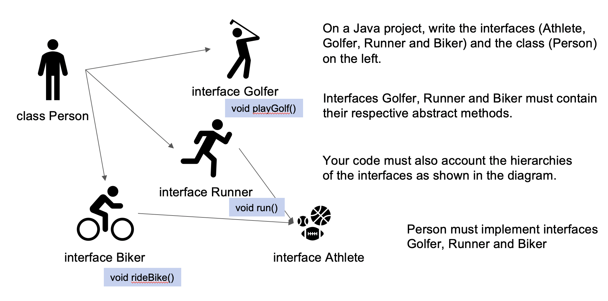
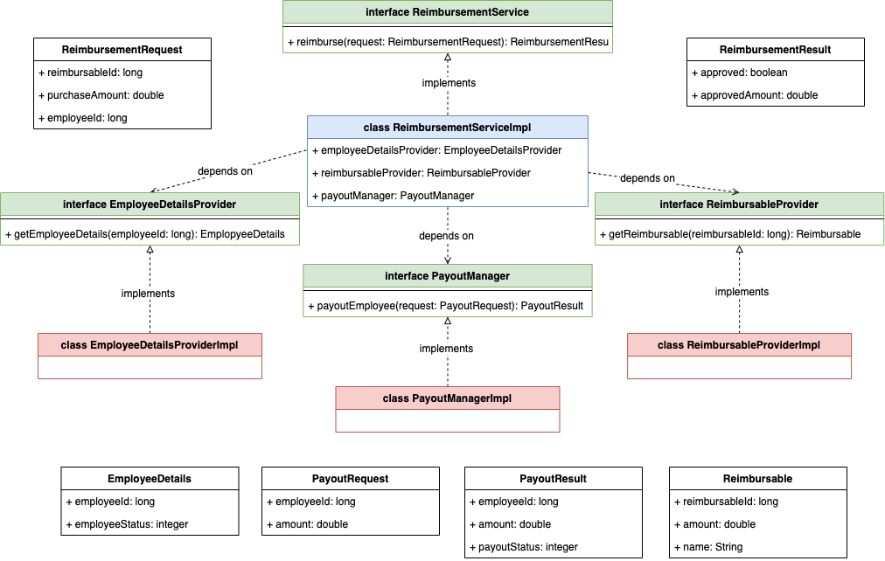

# Exercises on  Interfaces

## 1. Designing an Interface
Design an EchoDot interface which will allow user
* to increase volume
* decrease volume
* mute microphone
* unmute microphone

## 2. Implementing an Interface

## 3. Group Exercise
Design a class ReimbursementServiceImpl such that:
1. a _reimburse()_ method is being implemented from the ReimburseService interface;
2. the method should return a ReimbursementResult which tells whether the reimbursement request has been approved or not together with the approved amount;
3. the logic of the reimbursement approval goes like:

4. the class diagram should look like:

